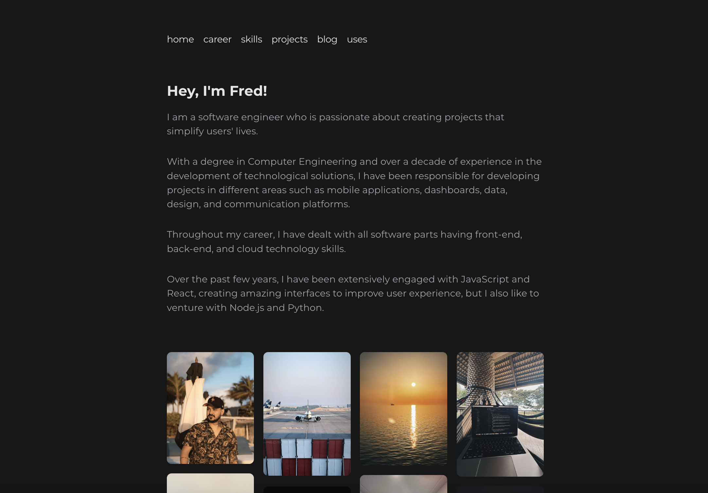

# F9ine

My personal website, portfolio and blog.

Available in: https://f9ine.com

## Getting Started

Clone the repo, enter in the f9ine folder and install the dependencies:

```
git clone https://github.com/fredvieira.git
cd f9ine
npm install
```

Node.js version >= v18.17.0 is required for run this project.
I'm using v18.20.4 and recommend the usage of NVM.

### Development

Run the development server:

```
npm run dev
```

Open [http://localhost:3000](http://localhost:3000) with your browser to see the initial page.

### Production

If you like to try the production build, run:

```
npm run build
```

And then:

```
npm run start
```

## Features

- [ ] Add comments with github auth

---

Made with ♥️ by Frederico Vieira
